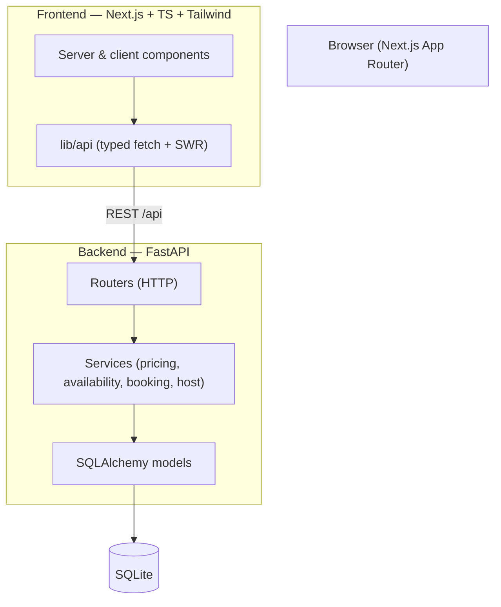
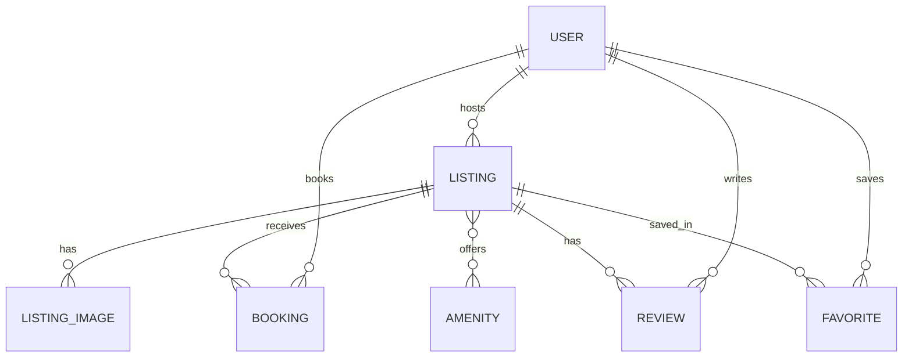

# StayFinder

A full-stack Airbnb-style property marketplace. Browse and search stays, filter by price,
type and amenities, view rich listing pages, book a date range with real availability
checking, manage your trips and wishlist, and — as a host — create, edit and track listings
from a dashboard.

Built with **Next.js (TypeScript)** and **FastAPI (Python)** over **SQLite**.

> This is an original implementation built as an SDE assignment. Airbnb was used only as a
> product and visual reference; all code, components, schema and seed data are original.

---

## Live demo

- **App:** _add deployed URL_
- **API docs:** _add deployed API URL_ `/docs`

Pick a demo identity from the avatar menu (top-right): **Alex Morgan** (guest),
**Sofia Ramos** and **Daniel Kim** (hosts). No sign-up required.

---

## Features

**Guest**
- Explore grid with photo-forward cards, guest-favorite badges, per-card image carousel
- Expandable search (destination · dates · guests) with shareable URL state
- Category row + a full filter sheet (price, property type, rooms, amenities, rating)
- Pagination via "show more"
- Listing detail: hero gallery + photo modal, amenities, reviews, map, host info
- Sticky reservation card with a **server-computed** price breakdown and a date picker that
  blocks unavailable nights
- End-to-end booking → mock checkout → confirmation code
- My Trips (upcoming / past / cancelled) with cancellation that frees the dates
- Wishlist with optimistic favoriting that persists per user

**Host**
- Dashboard with metrics computed from real data (listings, reservations, revenue, rating)
- Full listing CRUD (photos, pricing, capacity, amenities) with validation
- Reservations across all owned listings
- Ownership enforced server-side — a host can only mutate their own listings

**Cross-cutting:** responsive (mobile → desktop), toasts, skeletons, empty/error states,
accessible modals and controls, graceful 404.

---

## Tech stack

| Layer     | Choice |
|-----------|--------|
| Frontend  | Next.js 14 (App Router), TypeScript, Tailwind CSS, SWR, react-day-picker, Lucide, Sonner |
| Backend   | FastAPI, SQLAlchemy 2.0 (typed), Pydantic v2, Uvicorn |
| Database  | SQLite |
| Auth      | Google Identity Services + HttpOnly signed session cookie (google-auth, itsdangerous) |
| Testing   | pytest (50 backend tests) |

Money is stored and computed as **integer cents** end to end. Authentication uses **Google
sign-in** with an **HttpOnly signed session cookie**; the backend derives identity from the
session, never from a client-supplied id. Instant **demo guest/host** sessions flow through
the same architecture so evaluators can explore without any setup.

---

## Architecture



Routers handle HTTP only; all domain logic and transaction boundaries live in services.
See [docs/ARCHITECTURE.md](docs/ARCHITECTURE.md).

---

## Database design

Normalized schema; amenities and images are proper relations (never delimited strings).
Full rationale and indexes in [docs/DATABASE_DESIGN.md](docs/DATABASE_DESIGN.md).



### Booking availability (the core correctness model)

Dates are modeled as a **half-open interval** `[check_in, check_out)`. Two bookings conflict
iff:

```
existing.check_in < requested.check_out  AND  existing.check_out > requested.check_in
```

So `Oct 10→12` and `Oct 12→14` can coexist (the checkout day frees the night), while
`Oct 11→13` is rejected. Only `confirmed`/`pending` bookings hold dates; cancelling frees
them. Bookings are created inside a transaction that **re-checks** conflicts (page-load
availability can be stale) and returns `409 BOOKING_CONFLICT` if the dates were just taken.
Each booking stores a **price snapshot**, so later price changes never rewrite history.

---

## API overview

REST under `/api`, interactive docs at `/docs`. Errors use a consistent
`{ "error": { "code", "message" } }` shape. Full list in [docs/API_DESIGN.md](docs/API_DESIGN.md).

| Method | Path | Purpose |
|--------|------|---------|
| GET | `/api/health` | Health check |
| GET | `/api/listings` | Search/filter/paginate listings (availability-aware) |
| GET | `/api/listings/{id}` | Listing detail |
| GET | `/api/listings/{id}/availability` | Booked date ranges |
| GET | `/api/listings/{id}/reviews` | Reviews + aggregate |
| POST | `/api/bookings/quote` | Server-side price quote + availability |
| POST | `/api/bookings` | Create booking (atomic, 409 on conflict) |
| GET | `/api/trips` | Current user's bookings |
| POST | `/api/bookings/{id}/cancel` | Cancel own booking |
| GET/POST/DELETE | `/api/favorites...` | Wishlist |
| GET | `/api/host/metrics` | Host dashboard metrics |
| GET/POST/PATCH/DELETE | `/api/host/listings...` | Listing CRUD (ownership enforced) |
| GET | `/api/host/reservations` | Reservations across owned listings |
| GET | `/api/auth/me` · `/api/auth/config` | Current session · public client config |
| POST | `/api/auth/google` · `/api/auth/demo` | Sign in with Google · start a demo session |
| POST | `/api/auth/become-host` · `/api/auth/logout` | Enable hosting · sign out |

---

## Authentication

- **Google sign-in** ("Continue with Google"): the frontend obtains a Google ID token via
  Google Identity Services and posts it to `/api/auth/google`. The backend verifies the token
  with `google-auth`, upserts a user keyed on the **provider subject id** (not email), and
  issues a session.
- **Sessions** are a signed, **HttpOnly** cookie (`itsdangerous`) — never `localStorage`. The
  backend resolves the user from the cookie on every request; a client can never claim to be
  another user by editing a request body or id.
- **Authorization** is enforced server-side: guests cancel only their own bookings and manage
  only their own favorites; hosts edit/delete only their own listings and see only their own
  reservations and metrics.
- **Guest → host:** new accounts start as guests and enable hosting in one click
  (`/api/auth/become-host`) on the same account.
- **Demo access** (`/api/auth/demo`) issues a session for a built-in guest or host identity
  through the exact same cookie mechanism — no special bypass.

Anonymous visitors can browse, search, filter, open listings and read reviews. Booking,
favoriting, trips and hosting prompt a sign-in modal, preserving the intended action.

---

## Repository structure

```
backend/     FastAPI app (models, schemas, services, routers, seed, tests)
frontend/    Next.js app (app/ routes, components, hooks, lib, types)
docs/        Planning & design docs (architecture, DB, API, design system, tests)
```

---

## Demo access

Open the account menu (or any sign-in prompt) and choose **Explore as a demo guest** or
**Explore as a demo host** — no Google account needed. Each starts a real session.

| Identity | Role | Notes |
|----------|------|-------|
| Alex Morgan | Demo guest | Seeded upcoming, past and cancelled trips + a wishlist |
| Sofia Ramos | Demo host (Superhost) | Owns ~16 listings with reservations and reviews |
| Daniel Kim | Demo host (Superhost) | Owns the remaining listings |

---

## Running locally

**Prerequisites:** Python 3.10+, Node 18+.

### 1. Backend

```bash
cd backend
python -m venv .venv
# Windows: .venv\Scripts\activate   |   macOS/Linux: source .venv/bin/activate
pip install -r requirements.txt
python -m app.seed          # create & seed app.db (32 listings)
uvicorn app.main:app --reload --port 8000
```

API at `http://localhost:8000` (docs at `/docs`). `cp .env.example .env` to customize.
The app also seeds automatically on first startup if the database is empty.

### 2. Frontend

```bash
cd frontend
npm install
cp .env.example .env.local   # NEXT_PUBLIC_API_URL=http://localhost:8000
npm run dev
```

App at `http://localhost:3000`.

---

## Environment variables

**Backend** (`backend/.env`)
- `DATABASE_URL` — default `sqlite:///./app.db`
- `CORS_ORIGINS` — comma-separated allowed origins (the frontend URL)
- `SEED_ON_STARTUP` — `1` to seed an empty DB on boot
- `SESSION_SECRET` — secret used to sign session cookies (set a strong value in production)
- `COOKIE_SECURE` / `COOKIE_SAMESITE` — `1` / `none` for a cross-site HTTPS deployment, else `0` / `lax`
- `GOOGLE_CLIENT_ID` — Google OAuth web client id (blank disables Google sign-in; demo access still works)

**Frontend** (`frontend/.env.local`)
- `NEXT_PUBLIC_API_URL` — base URL of the backend (the Google client id is served by the backend)

---

## Google OAuth setup (optional for local dev)

Demo access needs no setup. To enable "Continue with Google":

1. In the [Google Cloud Console](https://console.cloud.google.com/) create an **OAuth client
   ID** of type **Web application**.
2. Add **Authorized JavaScript origins**: `http://localhost:3000` (and your deployed frontend
   origin in production).
3. Put the client id in `backend/.env` as `GOOGLE_CLIENT_ID`. The frontend reads it from
   `/api/auth/config`, so no frontend env var is needed.

Never commit the client id or any secret.

---

## Tests

```bash
cd backend && pytest        # 50 tests: booking matrix, ownership, favorites, host CRUD, auth
cd frontend && npm run build && npm run lint   # type-safe production build + lint
```

The booking suite covers overlap/adjacency, surrounding/inside ranges, zero-night, past
dates, capacity, server-side pricing, and cancellation freeing availability. Auth tests cover
first-login provisioning, returning-user reuse, session enforcement, tampered cookies, and the
guest→host transition (Google verification is mocked — no live Google calls).

---

## Deployment

- **Frontend → Vercel:** import `frontend/`, set `NEXT_PUBLIC_API_URL` to the backend URL.
- **Backend → Render:** [`render.yaml`](render.yaml) provisions a web service with a
  persistent disk for the SQLite file. Set `CORS_ORIGINS` to the Vercel URL. The service
  seeds the database on first boot.

SQLite is intentionally retained per the assignment; on ephemeral hosts a persistent disk
is used so bookings survive restarts.

---

## Engineering decisions & assumptions

- **Auth:** Google sign-in plus demo sessions, both over an HttpOnly signed session cookie.
  Identity is resolved server-side from the cookie; the frontend can never assert who it is.
  Demo access is kept so evaluators can start instantly without credentials.
- **No Alembic:** for a SQLite demo, `create_all` + an idempotent seed is more reliable and
  reproducible than migrations. Documented rather than hidden.
- **Integer cents** everywhere to avoid floating-point money bugs.
- **Server-authoritative pricing & availability:** the client never computes totals; the
  backend recomputes and re-checks inside the booking transaction.
- **Images:** curated royalty-free Unsplash URLs; the UI degrades gracefully if one fails.
- **Map:** a lightweight embedded OpenStreetMap view (no API key), per the assignment's
  "static/basic map is fine".

### Known limitations / future work
- Reviews are seeded; post-stay review creation is a natural next step (eligibility is
  already modeled via `booking_id`).
- Messaging and identity verification are intentionally out of scope.
- A production deployment would move to Postgres; the auth layer is already real.
