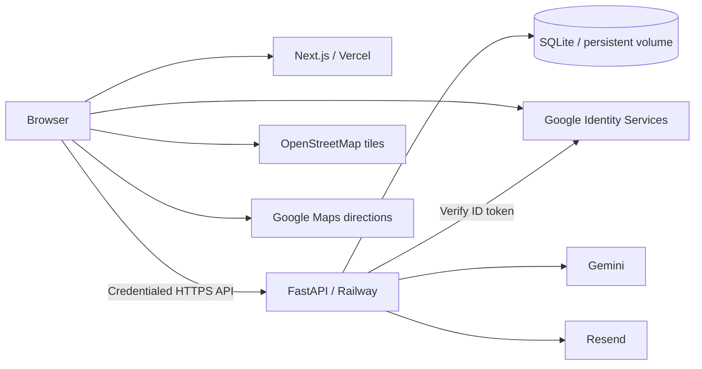
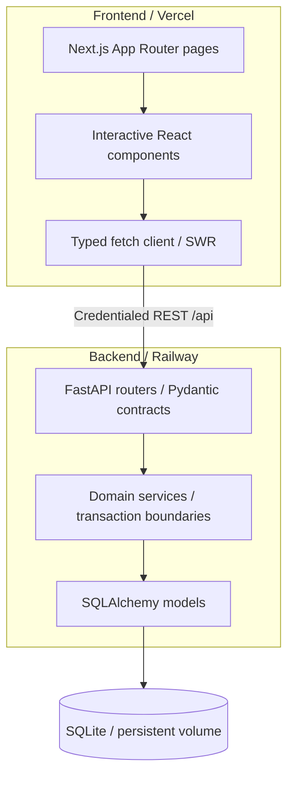
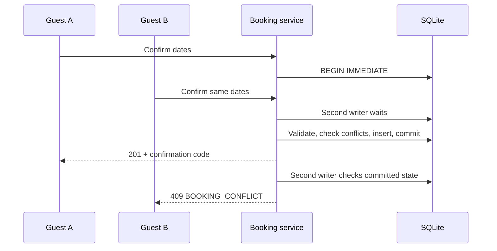
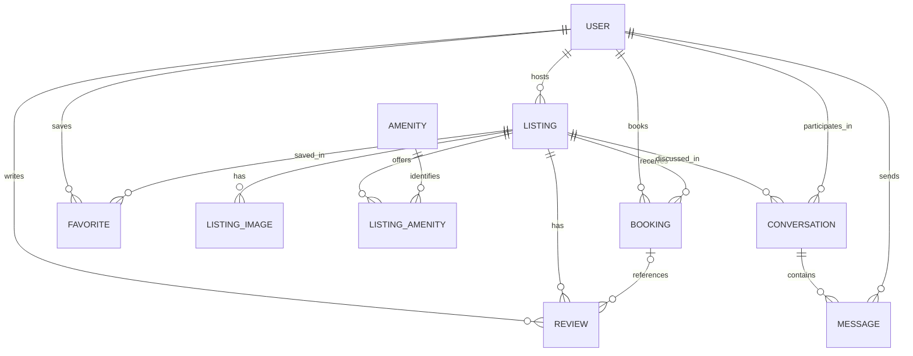

# StayFinder

A full-stack stay marketplace with destination search, map discovery, guest reservations, and host management. FastAPI owns availability, pricing, and authorization; a SQLite write transaction prevents competing requests from confirming overlapping stays.

## Live Demo

**Live Demo:** [https://stay-finder-alpha-neon.vercel.app](https://stay-finder-alpha-neon.vercel.app)

**API Docs:** [https://stayfinder-api-production-5645.up.railway.app/docs](https://stayfinder-api-production-5645.up.railway.app/docs)

**Backend:** [Railway API](https://stayfinder-api-production-5645.up.railway.app) · [Health](https://stayfinder-api-production-5645.up.railway.app/api/health)

## Demo Access

Open the account menu and choose:

- **Explore as a demo guest** — browse, favorite, book, and manage trips as Alex Morgan.
- **Explore as a demo host** — listings, reservations, dashboard, and messages as Sofia Ramos.
- **Continue with Google** — use your own account through Google Identity Services.

No local setup is required for the hosted demo. Checkout is simulated: **no payment is taken**. Demo identities are shared, so their data can also be changed by other evaluators.

## At a Glance

| Area | Implementation |
|---|---|
| Frontend | Next.js 14 App Router, React 18, TypeScript, Tailwind CSS, SWR |
| Backend | FastAPI, SQLAlchemy 2, Pydantic 2, Uvicorn |
| Database | SQLite on a Railway persistent volume |
| Deployment | Vercel frontend, one Railway backend instance |
| Auth | Google Identity Services and demo accounts; signed HttpOnly session cookie |
| AI | Gemini structured intent → validated, inventory-backed search |
| Email | Resend confirmation/cancellation integration; best-effort after commit |
| Maps | Leaflet/OpenStreetMap; Google Maps directions links |
| Testing | **100 passing backend tests**, lint/typecheck/build, production API audit |

## Highlights

- Photo-forward browsing, categories, destination/date/guest search, and shareable search URLs.
- Price, capacity, bedroom, bed, property type, amenity, and rating filters with result counts.
- Desktop compact search on scroll; map discovery with listing price markers.
- Listing galleries, amenities, reviews, host information, and availability calendars.
- Server-computed quotes, overlap protection, frozen booking prices, and cancellation.
- Persistent Wishlist, Trips, reservation details, and guest–host message threads.
- Host listing CRUD, reservation management, and metrics calculated from stored data.
- Google sign-in, grounded AI Concierge, and transactional email integration.

The interface takes inspiration from Airbnb; its implementation and branding are original.

## Architecture Snapshot



The browser calls Railway directly through the typed API client. Vercel serves Next.js; it is not an API proxy. Detailed references: [architecture](docs/ARCHITECTURE.md), [database](docs/DATABASE_DESIGN.md), [API](docs/API_DESIGN.md), and [release verification](docs/QA_REPORT.md).

## Product Flows

| Guest | Host |
|---|---|
| Search → filters/map → listing → quote | Enable hosting on the existing account |
| Reserve → mock checkout → confirmed reservation | Create/edit/delete owned listings |
| Trips → detail → directions/message/cancel | Dashboard → reservations → detail/messages |
| Save/remove a listing → Wishlist | Review metrics from actual listing/booking data |

Search state lives in URL parameters, allowing direct links and refresh. SWR handles fetched data and revalidation; identity changes refresh account-dependent caches. Favorites update optimistically and roll back on failure. Anonymous protected actions prompt for authentication. The favorites provider does not fetch `/api/favorites` while anonymous.

## Architecture and Design Decisions



**Backend:** routers validate HTTP contracts and shape responses. Services implement pricing, availability, transactions, ownership, messaging, and integrations. SQLAlchemy models define relationships, constraints, and indexes; Pydantic schemas define public contracts. Normal browsing and the concierge share the same search service.

Provider interfaces isolate Gemini and Resend, allowing failure tests without external calls. There is no queue, vector database, or separate AI reservation system.

**Frontend:** App Router pages compose interactive client components. `lib/api.ts` owns JSON/error handling and credentialed requests. Auth and favorites contexts keep shared state small; feature components own forms, calendars, maps, and modals. Leaflet loads with SSR disabled because it accesses browser globals.

Seeded remote media is served **unoptimized**, with a fallback image component. This favors reliable demo delivery over introducing an image processing/storage service.

## Booking Correctness

### Availability

Reservations use half-open intervals: **`[check_in, check_out)`**. A conflict exists when:

```text
existing.check_in < requested.check_out
AND existing.check_out > requested.check_in
```

`pending` and `confirmed` hold dates; `cancelled` does not. Checkout on another reservation's check-in day is allowed. Dates and capacity are validated again at creation, so an earlier quote does not reserve inventory.

### Concurrent requests

On SQLite, creation starts **`BEGIN IMMEDIATE` before reading availability**. The writer lock is held through validation, conflict checking, price calculation, insert, and commit. Another writer waits, then sees the first committed booking and receives `409 BOOKING_CONFLICT`. Errors roll back. Email runs after commit releases the lock.

Regression tests deliberately widen the read/write gap using separate SQLite connections to exercise competing confirmations. Protection depends on the service transaction; the schema has no exclusion constraint. The deployed backend remains a single SQLite instance.



### Pricing and snapshots

Amounts are stored and returned as integer cents. Current pricing uses Python `round` for fees:

```text
nights        = check_out - check_in
accommodation = nightly_rate_cents × nights
service_fee   = round(accommodation × 0.14)
taxes         = round((accommodation + cleaning_fee_cents) × 0.08)
total         = accommodation + cleaning_fee_cents + service_fee + taxes
```

For a $200 nightly rate, three nights, and $50 cleaning: accommodation $600, service fee $84, taxes $52, total **$786**. Client-supplied totals are ignored. Each booking stores its nightly rate, nights, cleaning fee, service fee, taxes, and total; later listing edits do not rewrite those values.

### Cancellation

Only the booking's guest may cancel, before the check-in date. Cancellation preserves the row and price snapshot and releases the interval. Repeated cancellation is idempotent and returns the cancelled booking. There is no real payment or refund settlement.

## Data Model



| Entity | Key responsibilities |
|---|---|
| User | Unique email, unique Google subject, role and host profile |
| Listing | Host ownership, location, pricing, capacity, category, derived ratings |
| ListingImage | Ordered images and alternative text |
| Amenity / ListingAmenity | Normalized many-to-many amenities |
| Booking | Dates/status, guest, frozen price snapshot, unique code, email timestamps |
| Review | Listing/author, optional booking, rating constrained to 1–5 |
| Favorite | Unique `(user_id, listing_id)` |
| Conversation | Unique `(listing_id, guest_id)`; guest and host participants |
| Message | Conversation, sender, body, read flag, timestamp |

Indexes support city, price, category, property type, booking listing/status and guest, conversation participants, and message order. Foreign keys are enabled per SQLite connection. Current listing deletion cascades dependent bookings, reviews, favorites, images, and conversations; this is demo CRUD, not a production reservation-retention policy.

The deterministic seed contains **32 listings**. `python -m app.seed` drops and recreates the local database; it is not a migration command. Production seeds are not rerun on startup.

## API Surface

Base: [Railway API](https://stayfinder-api-production-5645.up.railway.app). Public [Swagger UI](https://stayfinder-api-production-5645.up.railway.app/docs) is generated from deployed FastAPI schemas.

| Group | Representative endpoints |
|---|---|
| System | `GET /api/health` |
| Auth | `GET /api/auth/config`, `GET /api/auth/me`, `POST /api/auth/demo`, `/google`, `/become-host`, `/logout` |
| Browse | `GET /api/listings`, `/listings/{id}`, `/categories`, `/amenities`, `/listings/price-range` |
| Listing detail | `GET /api/listings/{id}/availability`, `/reviews` |
| Booking | `POST /api/bookings/quote`, `POST /api/bookings`, `GET /api/trips`, `GET /api/bookings/{id}`, `POST /api/bookings/{id}/cancel` |
| Wishlist | `GET /api/favorites`, `POST/DELETE /api/favorites/{listing_id}` |
| Hosting | `GET /api/host/metrics`, `/listings`, `/reservations`; listing `POST/PATCH/DELETE` |
| Messaging | `GET/POST /api/conversations`, `GET /api/conversations/{id}`, `POST /api/conversations/{id}/messages` |
| Concierge | `POST /api/concierge` |

Search supports location, dates, guests, price bounds, property type, category, repeated amenity IDs, bedrooms, beds, minimum rating, and sorting. Pages default to 18 results and are capped at 48. Responses include `items`, `total`, `page`, `page_size`, and `total_pages`.

Errors have a stable shape: `{ "error": { "code": "BOOKING_CONFLICT", "message": "..." } }`. Anonymous protected calls return 401; forbidden ownership/role returns 403; missing resources return 404; booking conflicts return 409; invalid inputs return 422.

## Authentication and Security

- GIS returns a Google ID token; Railway verifies it against `GOOGLE_CLIENT_ID` and upserts the user by immutable Google subject. This credential flow has no backend OAuth redirect route.
- Google and demo login issue the same signed `sf_session` cookie. Identity comes from that cookie, never from body fields or a user-ID header.
- Production uses **HttpOnly, Secure, SameSite=None**, path `/`, and a host-only cookie. Logout clears the same configuration. Local HTTP uses SameSite=Lax by default.
- CORS permits the exact Vercel origin with credentials. Frontend requests use `credentials: "include"`; no wildcard origin is combined with credentialed CORS.
- Hosting APIs require the host role. Enabling hosting changes the same account. Listing ownership and booking/conversation participation are checked server-side.
- Gemini/Resend keys and the session secret stay in backend environment settings. Env files, databases, dependencies, and build artifacts are ignored by Git.

There is no implemented rate limiter or dedicated CSRF-token mechanism. Cookie signing does not encrypt contents. These are boundaries to revisit before real payments or broader public operation.

## Gemini AI Concierge

```text
Message → Gemini JSON SearchIntent → Pydantic validation
→ inventory vocabulary normalization → amenity IDs → availability-aware search
→ real database listing cards + normal-search query string
```

The provider uses `generateContent`, a system instruction, `responseMimeType: application/json`, and a response schema. The repository default is `gemini-3.8-flash`; `AI_MODEL` can override it. Safe logs record provider/model, HTTP status, error category, and parsed intent without keys or authorization headers.

The deterministic parser runs when the provider is missing or fails, including timeout, malformed JSON, and schema errors. Gemini cannot create listings, invent prices, declare availability, access the database directly, or book automatically. No chat history is persisted.

Verified production search examples:

| Prompt | Observed grounded result |
|---|---|
| “do you have any properties in india” | `location=India`; zero results |
| “beachfront villa in Greece for 4 with a pool” | Greece, 4 guests, Villa, Beachfront, Pool; zero matches |
| “cheapest places in Lisbon” | Lisbon, `price_asc`; one real listing |
| Villa in Antarctica for 50 guests under $1 with a pool | Zero results |

The results are retrieved from StayFinder inventory after intent validation; a zero-result response is preserved when no listing matches.

## Transactional Email

Confirmation is attempted after booking commit; cancellation mail follows successful cancellation. Resend receives HTML and plain text with the reservation code and a link built from `FRONTEND_URL`. Confirmation HTML includes the price breakdown and directions.

The recipient is the stored booking guest's email, not a request-body address. Demo identities skip email. Successful sends set booking timestamps; an already-set timestamp skips another send. Failures are logged safely and do not roll back a committed booking.

Delivery is synchronous and best-effort, without durable retries or an outbox. Sending requires a configured Resend account and permitted sender; provider acceptance and inbox delivery are separate outcomes. Automated tests use a mocked provider to cover success, failure, timestamps, and winner-only delivery during a race.

## Maps and Location Policy

Leaflet renders OpenStreetMap tiles and a property pin or filtered result price markers. Directions open Google Maps using coordinates, with the address as a fallback.

Public listing responses omit the street address; confirmed reservation details expose it to the guest and listing host. Cancelled details hide it again. **Listing coordinates are public** and reused for reservation maps; there is no coordinate-obfuscation layer. Seeded locations are demo data, not verified operational accommodation addresses.

## Deployment and Production Hardening

| Component | Current deployment |
|---|---|
| Frontend | Vercel; project root `frontend`, branch `master` |
| Backend | Railway; project root `backend`, one instance |
| SQLite | `/var/data/stayfinder.db` on the `/var/data` persistent volume |

Railway installs `backend/requirements.txt` and starts `uvicorn app.main:app --host 0.0.0.0 --port $PORT`. `DATABASE_URL` points to the volume; `SEED_ON_STARTUP=0` prevents reseeding after initial seed. Vercel's `NEXT_PUBLIC_API_URL` is the stable Railway origin. Secrets live in provider settings. `render.yaml` is retained only as a legacy, unused blueprint.

Hardening includes cross-site cookies, exact-origin CORS, Google's verification transport dependency, Gemini request-format handling, SQLite booking serialization, and host-role enforcement. Deployment success is checked after pushing; the QA report records source revisions and persistence evidence.

## Verification

### Automated gates

**100 pytest tests pass**. Frontend ESLint, TypeScript (`tsc --noEmit`), and production build (`next build`) also pass.

Coverage includes auth, Google identity reuse with verification mocked, host role/ownership, booking validation/pricing/overlap/cancellation, favorites, messaging, privacy, search, concierge fallback/grounding, and email failure/idempotency.

Concurrency tests use a real temporary SQLite file, separate connections, independent authenticated API clients, and a widened read/write gap. They cover five exact-date races, four overlap shapes, both adjacency orders, three contenders, same-user double submit, cancel/rebook, participant isolation, and winner-only email delivery.

### Production API audit

- 198 successful checks across auth, CORS, search/filter results, categories, detail/ratings, favorites, concierge grounding, and host ownership/role.
- **14 race scenarios: 16 successful bookings, 12 clean 409 conflicts, zero 500s, zero lock errors, zero double bookings.** Two independent Demo Guest/Host sessions exercised five exact-date races, overlap shapes, adjacency, double submit, and cancel/rebook.
- Active-date invariants were checked through participant Trips responses. Direct Railway database access was unavailable. QA reservations on original listings were cancelled.
- Host CRUD/metrics, guest–host messages, reservation price agreement, and same-account hosting promotion were verified through production APIs.
- A Railway redeploy preserved the original 32 listings, favorites, messages, confirmed/cancelled bookings, and host edits on the persistent volume. Temporary QA fixtures were then removed.

The automated suite covers backend behavior and frontend compilation checks. The production results above are API-level checks, not an automated browser E2E suite. See the [QA report](docs/QA_REPORT.md) for test methods, results, and coverage boundaries.

### Run checks locally

```powershell
cd backend
.venv\Scripts\python -m pytest
cd ..\frontend
npm run lint
npm run typecheck
npm run build
```

## Local Setup

Prerequisites: Python 3.10+ and Node.js 18.17+ with npm. Core evaluation does not require Google, Gemini, Resend, Docker, or Redis.

### Backend — PowerShell

```powershell
git clone https://github.com/Apoorvan-A/StayFinder.git
cd StayFinder\backend
python -m venv .venv
.venv\Scripts\python -m pip install -r requirements.txt
Copy-Item .env.example .env
.venv\Scripts\python -m app.seed
.venv\Scripts\python -m uvicorn app.main:app --reload --port 8000
```

The seed command **replaces the local database**. Never run it against the production volume. On macOS/Linux use `.venv/bin/python` and `cp .env.example .env`.

### Frontend — second terminal

```powershell
cd StayFinder\frontend
npm ci
Copy-Item .env.example .env.local
npm run dev
```

Open `http://localhost:3000`. The example targets the backend on `http://localhost:8000`. On macOS/Linux use `cp .env.example .env.local`.

## Environment Variables

Copy the examples; keep real secrets outside Git. All variables are backend-only except `NEXT_PUBLIC_API_URL`. The public Google client ID is obtained from `/api/auth/config`.

| Variable | Required? | Secret? | Purpose |
|---|---|---|---|
| `DATABASE_URL` | Production | No | SQLAlchemy database/volume location |
| `SESSION_SECRET` | Production | Yes | Session signing; replace the development default |
| `CORS_ORIGINS` | Production | No | Exact allowed frontend origins |
| `COOKIE_SECURE` | Production configuration | No | Secure-cookie flag |
| `COOKIE_SAMESITE` | Production configuration | No | Cross-site cookie policy |
| `SEED_ON_STARTUP` | Deployment configuration | No | Seed an empty database; disable after initial seed |
| `FRONTEND_URL` | Hosted email integration | No | Stable origin for email links |
| `GOOGLE_CLIENT_ID` | Optional | No | Expected Google Web client audience |
| `AI_PROVIDER` | Optional | No | Concierge provider selection |
| `AI_API_KEY` | Optional | Yes | Gemini server credential |
| `AI_MODEL` | Optional | No | Override the Gemini default model |
| `EMAIL_PROVIDER` | Optional | No | Email provider selection |
| `EMAIL_API_KEY` | Optional | Yes | Resend server credential |
| `EMAIL_FROM` | Optional | No | Sender permitted by Resend account/domain |
| `NEXT_PUBLIC_API_URL` | Frontend | No | Backend origin compiled into frontend |

Configuration: [backend example](backend/.env.example), [frontend example](frontend/.env.example), and `backend/app/config.py`.

## Project Structure

```text
backend/
  app/
    routers/       HTTP endpoints
    services/      booking, pricing, availability, auth, host, messaging, integrations
    models/        SQLAlchemy entities and constraints
    schemas/       Pydantic contracts
    seed.py        deterministic local fixture data
  tests/           isolated regression and concurrency tests
frontend/
  src/app/         Next.js routes
  src/components/  search, listing, booking, host, messaging, map, concierge, auth
  src/hooks/       auth, favorites, concierge state
  src/lib/         typed API client and formatting
docs/              architecture, schema, API, QA, handoff
```

## Assignment Requirements Matrix

| Requirement | StayFinder implementation |
|---|---|
| Browse/search/cards | Paginated listing API, photo cards, URL-based search |
| Filters/categories | Server filters, category navigation, dynamic counts |
| Pagination | Bounded page size, total/page metadata, Show more |
| Detail/gallery/amenities/reviews | Detail API, photo modal, host/review sections |
| Calendar/pricing | Booked-range API and authoritative quote |
| Booking/overlap/checkout | SQLite writer lock, 409 conflicts, simulated checkout |
| Trips/persistence | Stored bookings, status views, details and cancellation |
| Host CRUD/dashboard | Role/ownership checks, metrics and reservations |
| Wishlist | Per-user favorite rows and optimistic UI |
| SQLite/schema/API/README | Normalized models, constraints/indexes, Swagger, design docs |
| Airbnb-inspired UX/responsiveness | Original StayFinder header, cards, categories and layouts |
| Bonus: maps/directions | Leaflet/OpenStreetMap and Google Maps link |
| Bonus: Google auth | GIS verification and account reuse |
| Bonus: AI Concierge | Structured-intent, inventory-grounded search |
| Bonus: email/messaging | Resend integration and participant-only persisted threads |

## Tradeoffs and Assumptions

| Current choice | Benefit | Limitation | Possible evolution |
|---|---|---|---|
| SQLite / one backend instance | Small operational footprint, durable volume | Serialized writes; no horizontal write scaling | PostgreSQL |
| Mock checkout | Safe evaluation without financial credentials | No settlement/refunds | Payment provider/webhooks |
| Synchronous email | Simple post-commit behavior | Request latency; no durable retry | Outbox/worker |
| REST messaging | Persistent, auditable authorization | No live push | SSE/WebSocket where justified |
| Seeded remote media | Complete demo inventory | Static media, external availability | Object storage/CDN |
| Shared demo users | Immediate access | Shared mutable history | Isolated evaluator fixtures |
| Simplified policies/hosting | Clear guest and host flows | No operational host verification or rich refund rules | Onboarding/policy checks |

Hosts and addresses are demo data. There is no real payment collection, verified accommodation ownership, or operating hospitality inventory. Listing deletion removes dependent reservations. Email timestamps provide application-level send suppression, not exactly-once delivery through every process failure.

## Known Limitations

- Checkout is simulated; no payment settlement or refund processing exists.
- SQLite serializes writes and the hosted backend is a single instance.
- Messages persist but do not arrive through a real-time push channel.
- Email is best-effort and synchronous, without durable retries.
- Seeded media/addresses, simplified policies, shared demo identities, and cascade deletion reflect demonstration scope.
- Automated browser E2E coverage is not included.

## Scalability: Current and Future

**Implemented:** server pagination capped at 48, SQL filters, relevant indexes, explicit relationship loading, service boundaries, environment configuration, and health endpoint. SQLite's writer lock protects overlap correctness while limiting concurrent writes. No horizontal scaling is claimed.

**Future options, not implemented:** PostgreSQL with transactional overlap enforcement; object storage/CDN; stateless FastAPI instances behind a load balancer; Redis only for measured cache/rate-limit needs; outbox/workers; observability and rate limiting. Real payments and live messaging are separate extensions, not requirements to run this project.
