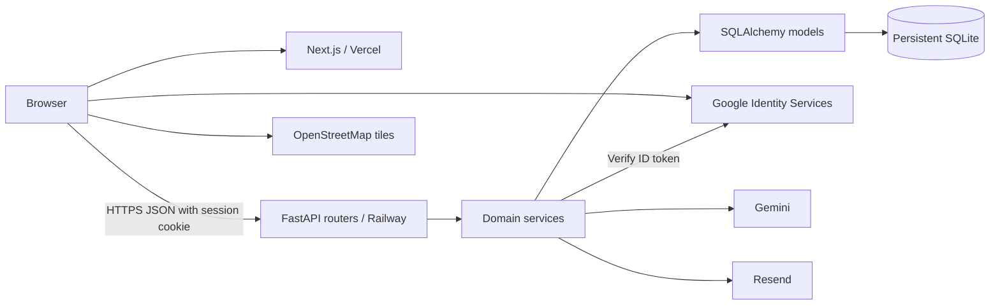

# Architecture

StayFinder is a Next.js frontend on Vercel and a FastAPI backend on Railway. Browser API requests go directly to Railway with credentials. SQLite lives on Railway's persistent `/var/data` volume; the backend runs as one instance.



## Backend boundaries

- Routers parse requests, invoke services, and serialize public contracts.
- Services own pricing, availability, transactions, ownership, messaging, and integrations.
- Models define foreign keys, relationships, constraints, and indexes.
- Pydantic schemas validate request/response contracts.

## Frontend

App Router pages compose feature components in `src/components/`. `src/lib/api.ts` provides a typed credentialed fetch client and normalized errors. SWR handles fetched state and revalidation. Auth and favorites contexts provide shared identity-dependent state; search criteria are encoded in URL parameters. No separate `features/` directory exists.

Leaflet is dynamically imported with SSR disabled. Remote demo media is served unoptimized, with a fallback component. Desktop search changes between full and compact modes at scroll thresholds; mobile remains separate and reduced-motion CSS disables transition animation.

## Trust boundaries

Authentication derives identity from a signed HttpOnly cookie. Google ID tokens are verified on the backend against the configured client audience; Google subject identifies returning accounts. Demo identities use the same session mechanism. Host routes require the host role, and individual listing operations additionally check ownership. Reservation and conversation access checks participants server-side.

The browser is not trusted for price, availability, user identity, or email recipient. Cross-site production cookies use Secure and SameSite=None, with exact-origin credentialed CORS. Local HTTP development retains lax cookies.

## Booking transaction

On SQLite, `create_booking` clears the earlier read transaction and acquires `BEGIN IMMEDIATE` before loading listing/availability state. Competing writers serialize. The transaction validates dates/capacity, rechecks overlapping pending/confirmed bookings, calculates pricing, inserts a snapshot, and commits. A losing competitor sees the committed conflict and returns 409; failures roll back. Adjacent half-open intervals are permitted.

A quote is a read-only estimate, not a hold. Cancellation changes status and frees dates before check-in; it is idempotent for already-cancelled bookings. Money is stored as integer cents, with the current percentage fees rounded by Python's pricing function.

## Concierge

```text
Message → optional Gemini structured intent → validation/normalization
→ existing search service → SQLite → real listing results
```

Gemini cannot invent returned inventory, prices, or availability. The backend maps supported vocabulary and amenity IDs, then performs the same availability-aware search used by Explore. Missing provider configuration or a provider/parse failure invokes the deterministic fallback. Safe logs record status/error category and intent, without credentials. No vector store or persisted chat history exists.

## Email

Booking commit precedes the synchronous Resend attempt. Cancellation email follows cancellation. Recipients come from stored guest identity; demo users skip delivery. Successful sends record timestamps used to suppress subsequent sends. Failures do not roll back reservations. There is no durable retry worker or exactly-once guarantee across process failures. Final real inbox verification was skipped; see the QA report.

## Messaging and maps

Conversations/messages persist in SQLite and authorize the guest/host participants. REST fetch/post supports unread flags; there is no WebSocket service.

Leaflet renders OpenStreetMap tiles and pins/price markers. Public responses withhold the street address but expose coordinates. Confirmed reservation details reveal the address to participants; directions use a Google Maps URL. Coordinates are not obfuscated.

## Current deployment and scaling limits

- Vercel root: `frontend`; public production origin documented in README.
- Railway root: `backend`; Uvicorn binds `0.0.0.0:$PORT`.
- Database: `sqlite:////var/data/stayfinder.db`; volume `/var/data`; `SEED_ON_STARTUP=0`.
- Backend: one instance; serialized SQLite writes, no horizontal scaling claim.
- `render.yaml` is a legacy unused blueprint, not current infrastructure.

Implemented query controls include bounded pagination, indexes, SQL filtering, and explicit relationship loading. PostgreSQL, object storage/CDN, outbox/workers, horizontal instances, Redis, rate limiting, and richer observability are future options, not installed systems. Feature development is frozen.
