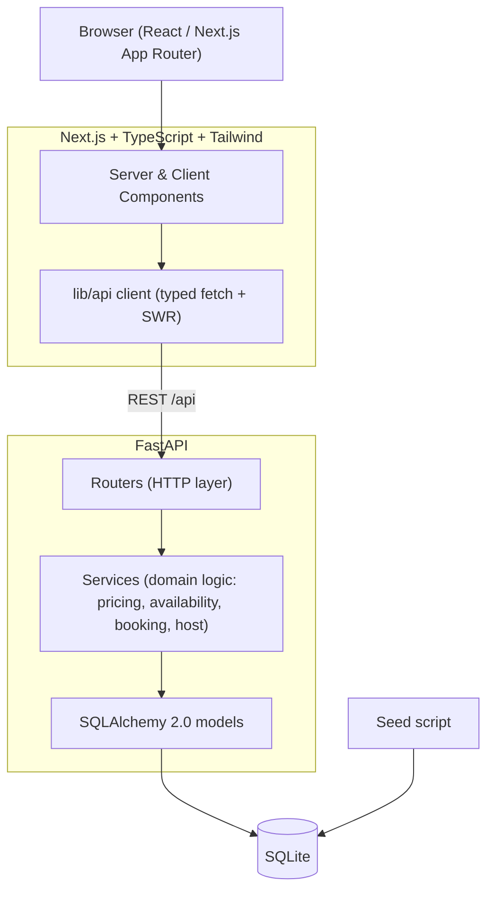

# Architecture

A conventional two-tier app: a Next.js frontend talking to a FastAPI backend over REST,
with SQLite for persistence. No speculative infrastructure — the complexity lives in product
behavior (booking correctness, search, host flows), not in the deployment topology.

## Layering (backend)
- **Routers** — HTTP concerns only: parse/validate request, call a service, shape response.
- **Services** — all domain logic and transaction boundaries (booking conflict re-check,
  server-side pricing, ownership checks). No business logic in handlers.
- **Models/Schemas** — SQLAlchemy ORM + Pydantic v2 request/response contracts.

## Frontend structure
- `app/` route segments (App Router). Server components fetch where possible; client
  components only where interactivity is needed (search, calendar, favorites, forms).
- `lib/` typed API client + formatters; `components/` reusable UI; `features/` feature
  modules (search, listing, booking, host); `hooks/`; `types/` shared contracts.
- Global state kept minimal: a demo-user context + favorites cache (SWR).

## Trust boundary
The frontend never computes authoritative totals or availability. The backend recomputes
price and re-checks conflicts inside the booking transaction, and enforces ownership on all
host/guest mutations regardless of IDs supplied by the client.

## Deployment
- Frontend → Vercel (`NEXT_PUBLIC_API_URL` → backend).
- Backend → Render (persistent disk for the SQLite file; seeded on first boot).
