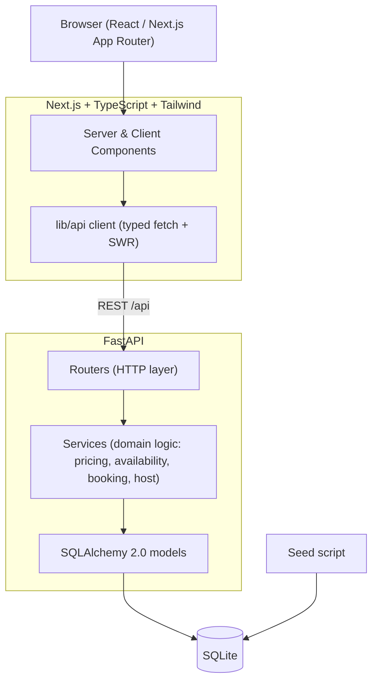

# Architecture

A conventional two-tier app: a Next.js frontend talking to a FastAPI backend over REST,
with SQLite for persistence. No speculative infrastructure — the complexity lives in product
behavior (booking correctness, search, host flows), not in the deployment topology.

## Layering (backend)
- **Routers** — HTTP concerns only: parse/validate request, call a service, shape response.
- **Services** — all domain logic and transaction boundaries (booking conflict re-check,
  server-side pricing, ownership checks). No business logic in handlers.
- **Models/Schemas** — SQLAlchemy ORM + Pydantic v2 request/response contracts.

## Frontend structure
- `app/` route segments (App Router). Server components fetch where possible; client
  components only where interactivity is needed (search, calendar, favorites, forms).
- `lib/` typed API client + formatters; `components/` reusable UI; `features/` feature
  modules (search, listing, booking, host); `hooks/`; `types/` shared contracts.
- Global state kept minimal: a demo-user context + favorites cache (SWR).

## Auth & sessions
Google Identity Services yields an ID token the frontend posts to `/api/auth/google`; the
backend verifies it (`google-auth`), upserts a user keyed on the Google subject id, and issues
a signed **HttpOnly** session cookie (`itsdangerous`). Demo guest/host logins issue the same
cookie. Every request resolves identity from the cookie — there is no client-supplied user id.

## Trust boundary
The frontend never computes authoritative totals or availability, and never asserts identity.
The backend derives the user from the session cookie, recomputes price and re-checks conflicts
inside the booking transaction, and enforces ownership on all host/guest mutations regardless
of anything supplied in the request body.

## External integrations
- **Google OAuth** — ID-token sign-in (verified server-side).
- **Google Maps** — an external *directions* link (`maps/dir/?...`) on confirmed reservations;
  no API key and no exact location on the public listing.
- **Leaflet + OpenStreetMap** — interactive maps (no API key), loaded client-only via dynamic
  import: a price-marker results map (desktop split view / mobile fullscreen), a location pin on
  the public listing (approximate city coordinates, no exact address shown), and the exact pin
  on a confirmed reservation.

## Messaging
Persisted in-app messaging (`conversations` + `messages`) between a guest and a host about a
listing. No real-time infrastructure — threads are fetched and posted over plain REST, and the
backend authorizes every read/write to the thread's two participants.

## Deployment
- Frontend → Vercel (`NEXT_PUBLIC_API_URL` → backend).
- Backend → Render (persistent disk for the SQLite file; seeded on first boot).
