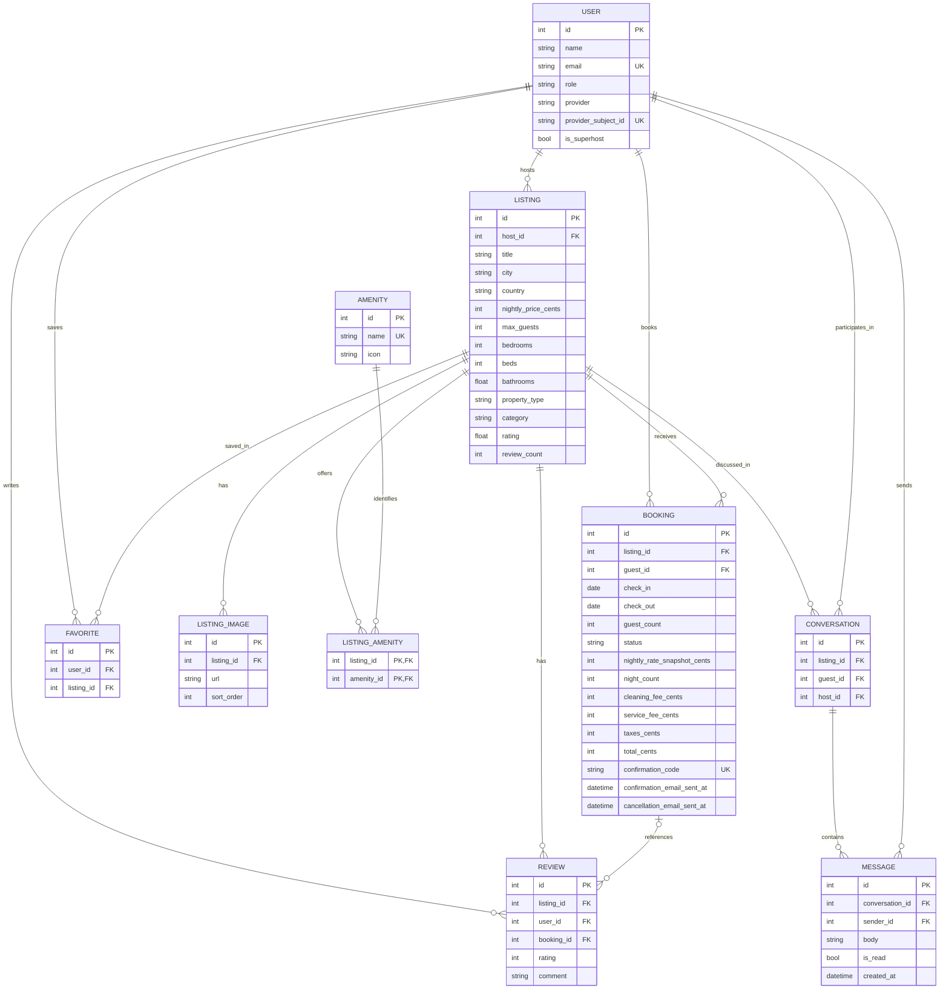

# Database Design

SQLite via SQLAlchemy 2.0 (typed, declarative). Schema is normalized; the booking
availability model is the core correctness concern.

## Entities & key decisions

- **users** — `id`, `name`, `email` (unique), `avatar_url`, `role` (`guest`/`host`),
  `is_superhost`, `provider` (`google`/`demo`), `provider_subject_id` (unique external id),
  `created_at`. Google accounts are keyed on the immutable `provider_subject_id`, not email;
  a guest enables hosting by switching `role` to `host`.
- **listings** — host-owned property. Price stored as `nightly_price_cents` (integer
  minor units — no float money). Denormalized `rating`/`review_count` are **derived** and
  recomputed from reviews, kept for cheap list queries. Geo via `latitude`/`longitude`.
- **listing_images** — one row per photo (`sort_order`, `alt_text`). Never a delimited string.
- **amenities** / **listing_amenities** — many-to-many. Never a CSV column.
- **bookings** — `check_in`/`check_out` (DATE, half-open `[check_in, check_out)`),
  `status`, `guest_count`, and **price snapshot** columns (`nightly_rate_snapshot_cents`,
  `night_count`, `cleaning_fee_cents`, `service_fee_cents`, `taxes_cents`, `total_cents`) so
  historical bookings keep their totals if the listing price later changes.
  `confirmation_code` unique.
- **reviews** — `rating` (1–5, CHECK), `comment`, author, optional `booking_id`.
- **favorites** — composite unique `(user_id, listing_id)`; no duplicate wishlisting.
- **conversations** — a message thread between a `guest_id` and `host_id` about one
  `listing_id`; unique `(listing_id, guest_id)` so there is one thread per guest per listing.
- **messages** — belong to a conversation, with `sender_id`, `body`, `is_read`, `created_at`.

Additional fields added for the product: **users** carry optional host-profile data
(`host_since_year`, `response_rate`, `response_time`, `languages`) and the external-identity
fields (`provider`, `provider_subject_id`). **listings** carry `check_in_time`,
`check_out_time` and an `area_description` (the general-area blurb shown publicly), while the
exact `address` is never exposed on the public listing.

## Money
All monetary values are **integer cents**. Formatting to currency happens only at the edge.

## Booking overlap semantics (half-open intervals)
Dates model a half-open interval `[check_in, check_out)`. Two bookings conflict iff:

```
existing.check_in < requested.check_out AND existing.check_out > requested.check_in
```

So `Oct 10→12` and `Oct 12→14` coexist (checkout day frees the night), while `Oct 11→13`
is rejected. Only **availability-holding statuses** (`confirmed`, `pending`) block dates;
`cancelled` frees them.

## Constraints & indexes
- FKs with sensible `ON DELETE` behavior (listing delete cascades images/amenities; bookings
  are deleted by cascade, never orphaned).
- Unique: `users.email`, `favorites(user_id, listing_id)`, `bookings.confirmation_code`,
  `listing_amenities(listing_id, amenity_id)`.
- CHECK: `review.rating BETWEEN 1 AND 5`, `booking.check_out > booking.check_in`,
  `guest_count >= 1`, non-negative money.
- Indexes: `listings(city)`, `listings(nightly_price_cents)`, `listings(property_type)`,
  `listings(category)`, `bookings(listing_id, status)`, `bookings(guest_id)`,
  `reviews(listing_id)`, `favorites(user_id)`, `conversations(guest_id)`,
  `conversations(host_id)`, `messages(conversation_id, created_at)`.

## ER diagram


## Concurrency and email fields

SQLite booking creation acquires `BEGIN IMMEDIATE` before reading availability and holds its writer lock through insertion/commit. Competing requests cannot both pass the check on stale state. This is service-level transactional protection, not a schema exclusion constraint. The deployed backend remains single-instance.

Bookings also contain `confirmation_email_sent_at` and `cancellation_email_sent_at`. Successful provider calls set them; failures leave them unset. They support best-effort application send suppression, not a durable outbox.

## Deletion and location boundaries

Deleting a listing cascades its bookings as well as images, reviews, favorites, and conversations/messages. Existing bookings are not retained as archival records after deletion. Street addresses are omitted from public listing schemas, but latitude/longitude remain public. There is no separate coordinate-obfuscation store.
